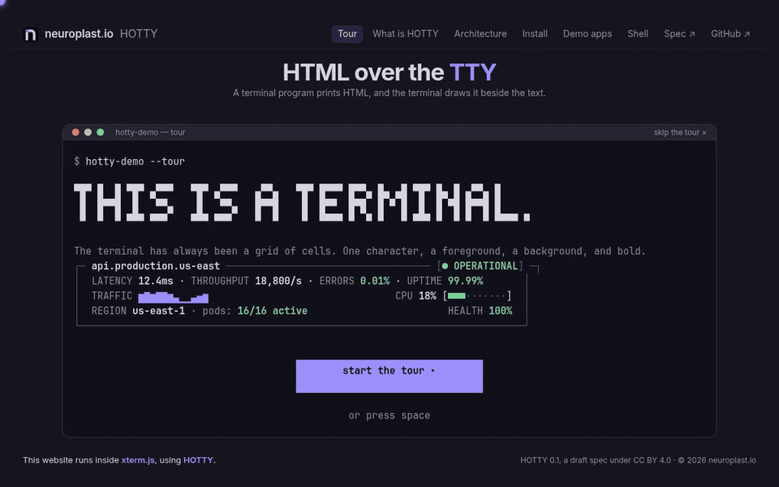

<div align="center">

# HOTTY

**HTML over the TTY.**

A terminal program prints small HTML documents — **surfaces** — and the terminal
lays them out and draws them into rectangles of cells. No script, no network, no
browser: everything travels in-band, so it works over a pty and SSH, and falls
back to plain text where there is no host.



[](#status)
[](LICENSE-CC-BY-4.0)
[](LICENSE-APACHE)

[Website](https://hotty.neuroplast.io) ·
[Specification](SPEC.md) ·
[SDK](SDK.md) ·
[Conformance](conformance/) ·
[Examples](examples/)

</div>

## Why HOTTY

A terminal program has cells: monospace characters with a few attributes. HOTTY
adds a second kind of output: a **surface**, one HTML document placed on a
rectangle of cells. The host lays it out and draws it at the terminal's own
resolution — proportional type, tables, form controls, SVG, images — and outside
it everything stays a terminal. Clicks, changes and submits come back to the
program as events on its input.

HOTTY is designed around four constraints:

- **In-band.** Everything a surface needs travels in the program's output stream.
  Nothing is loaded from files or the network, so a program behaves the same
  locally, over SSH and inside a container.
- **The program is the application.** Surfaces have no script. The program holds
  the state and decides what every event means; the terminal is the view.
- **Deltas, not redraws.** Updates are addressed by element id, so a change costs
  what it changes — a live number is tens of bytes.
- **Degrade, never break.** A program detects its host and falls back to plain
  cells where there is none.

## Status

**Version 0.1, a draft.** Versions 0.x may change incompatibly (§15 of the
[spec](SPEC.md)). Two implementations that share no code pass the conformance
vectors: [hotty-blitz](https://github.com/neuroplastio/hotty-blitz), a renderer
with a C ABI and a polyfill for terminals that show images, and
[xterm-addon-hotty](https://github.com/neuroplastio/xterm-addon-hotty), for
xterm.js in a browser.

## Quick start

The quickest host is [**hottyterm**](https://github.com/neuroplastio/hottyterm),
a fork of Ghostty with a native HOTTY host:

```sh
brew install --cask neuroplastio/tap/hottyterm   # macOS on Apple silicon
yay -S hottyterm-bin                             # Arch Linux on x86_64
```

Then run an example in it:

```sh
python3 examples/dash.py
```

Nothing to install? [hotty.neuroplast.io](https://hotty.neuroplast.io) is a
HOTTY program too: the tour, the demo apps and a toolkit of HOTTY tools, in a
browser through xterm-addon-hotty or natively in hottyterm.

## Repositories

| repository | what |
| --- | --- |
| `hotty` | this one: the protocol, its conformance vectors and the reference material |
| [`hotty-go`](https://github.com/neuroplastio/hotty-go) | the Go SDK: the protocol, `hottytea` for Bubble Tea, `hottyterm` for command-line tools, and `hottytest`, a host for tests |
| [`hotty-lua`](https://github.com/neuroplastio/hotty-lua) | the Lua SDK: the wire layer, `hotty.nvim` for Neovim and `hotty.plx` for plx scripts |
| [`hotty-demo`](https://github.com/neuroplastio/hotty-demo) | the website, [hotty.neuroplast.io](https://hotty.neuroplast.io): the tour, the demo apps and the toolkit, as one terminal program (native and WebAssembly) |
| [`hottyterm`](https://github.com/neuroplastio/hottyterm) | a terminal that speaks HOTTY natively: a fork of Ghostty with hotty-blitz built in, installed with Homebrew or the AUR |
| [`hotty-blitz`](https://github.com/neuroplastio/hotty-blitz) | a renderer (Rust, on Blitz) with a C ABI for terminals, and `hotty run`, a polyfill that shows surfaces in any terminal with kitty graphics |
| [`xterm-addon-hotty`](https://github.com/neuroplastio/xterm-addon-hotty) | an xterm.js addon: the browser renders each surface in a sandboxed iframe |

## What is here

| path | what |
| --- | --- |
| [`SPEC.md`](SPEC.md) | the protocol |
| [`SDK.md`](SDK.md) | what a library that speaks HOTTY for programs provides, in any language: its components, options, defaults and names |
| [`conformance/`](conformance/) | the conformance vectors: what a host and an SDK must do, as data |
| [`corpus/`](corpus/) | pages that exercise the HTML and CSS a surface is expected to handle |
| [`examples/`](examples/) | programs that speak HOTTY: a card, a dashboard, a form, a large grid, a game |
| [`clients/python/hotty.py`](clients/python/hotty.py) | a dependency-free reference client with SDK.md's whole wire layer, used by the examples and the hosts' tests; `test_vectors.py` runs the SDK vectors against it |

## Other hosts

- **kitty, Ghostty and other terminals with kitty graphics** show surfaces
  through hotty-blitz's polyfill. Build it from
  [hotty-blitz](https://github.com/neuroplastio/hotty-blitz) (`mise install &&
  make release`), then:

  ```sh
  hotty run -- python3 examples/dash.py
  ```

- **A browser**: [xterm-addon-hotty](https://github.com/neuroplastio/xterm-addon-hotty)
  is a host for xterm.js:

  ```sh
  python3 serve.py --examples      # in xterm-addon-hotty, then open /?run=dash
  ```

`examples/bubbros.py` needs the game first: `scripts/bubbros-fetch.sh`. Its art
is not ours to publish; it is replaced before anything built on it is.

## Changing the protocol

- **A change to the wire** goes into [`SPEC.md`](SPEC.md) and
  [`conformance/vectors.json`](conformance/vectors.json) together, and both
  implementations run the new vectors. A change that breaks existing programs or
  hosts needs a new version (§15).
- **Extensions** live in implementations under a vendor prefix (§15). They come
  here when a second implementation wants them.

## Licence

- `SPEC.md` and the documentation: [CC BY 4.0](LICENSE-CC-BY-4.0).
- The vectors, corpus, examples and client: [Apache-2.0](LICENSE-APACHE).
